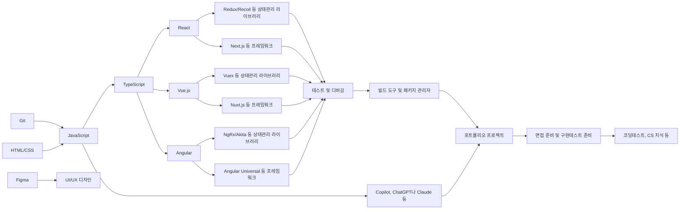
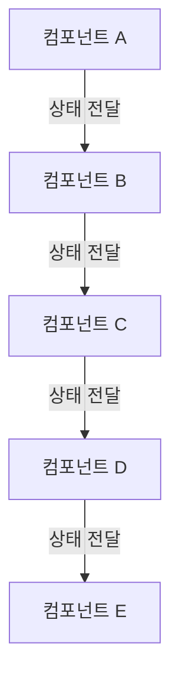
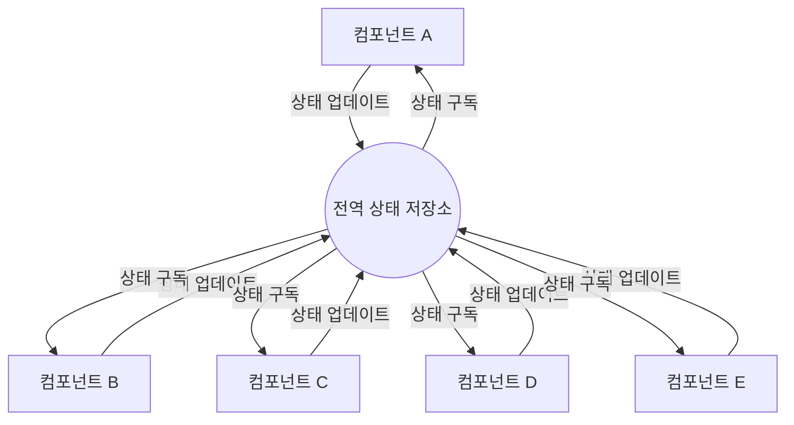

# frontend-developer-guide

- FE 개발자로 쌓아야 할 기술 스택, 면접관 입장에서 매력적으로 보이는 포트폴리오

## 0. 목차

- 1. 배우는 순서
- 2. 추천 기술 스택

  - 2.1. 통계자료
  - 2.2. HTML/CSS
    - 2.2.1. sass/scss
  - 2.3. JavaScript
    - 2.3.1. (매우 중요) 견고한 ES6+
    - 2.3.2. TypeScript
  - 2.4. 프레임워크 및 라이브러리
    - 2.4.1. React
      - 2.4.1.1. Redux/Recoil 등 상태관리 라이브러리
  - 2.5. 빌드 도구 및 패키지 관리자
    - 2.5.1. Webpack
    - 2.5.2. Babel
    - 2.5.3. npm/yarn
  - 2.6. 버전 관리 시스템
    - 2.6.1. Git
    - 2.6.2. GitHub
  - 2.7. 테스트 및 디버깅
    - 2.7.1. Jest
    - 2.7.2. Mocha/Chai
    - 2.7.3. Chrome DevTools
  - 2.8 자동화 도구
    - 2.8.1. Prettier
    - 2.8.2. (매우 중요) Copilot, ChatGPT나 Claude 등

- 3. 포트폴리오

  - 3.1. 프로젝트 선정
    - 3.1.1. 실무 관련성
    - 3.1.2. 기술적 도전
  - 3.2. 코드 품질
    - 3.2.1. 가독성 및 유지보수성
    - 3.2.2. 성능 최적화
    - 3.2.3. 테스트 커버리지
  - 3.3. 문서화
    - 3.3.1. README
    - 3.3.2. 기술 선택 이유
    - 3.3.3. 프로젝트 구조 설명
  - 3.4. 시각적 요소
    - 3.4.1. 사용자 경험 (UX)
    - 3.4.2. 반응형 디자인
    - 3.4.3. 애니메이션 및 인터랙션

- 4. 면접 준비

  - 4.1. 기술 질문 대비
  - 4.2. 프로젝트 설명 연습
  - 4.3. 소프트 스킬 및 커뮤니케이션
  - 4.4. 커뮤니티 활동
  - 4.5. 스터디
  - 4.6. 책 출판
  - 4.7. 블로그 운영
  - 4.8. 유튜브 채널 운영
  - 4.9. 강의 제작

- 5. 지속적인 학습

  - 5.1. 최신 트렌드 파악
  - 5.2. 개인 프로젝트 및 실험
  - 5.3. 오픈소스 기여

- 6. 질의응답

## 1. 배우는 순서

## 2. 추천 기술 스택

위니브에서 사용하는 기술 스택은 다음과 같습니다. 최신 트렌드에 매우 민감하고 반응하려 노력하고 있습니다. 원하는 기업 리스트를 뽑고, 기술 스택을 파악하고, 해당 기술 스택을 타겟팅하여 학습하면 좋습니다.

- 백엔드
  - Python 진형
  - Django
  - FastAPI
  - JavaScript 진형
  - Node.js
  - Express
  - DB
    - MongoDB
    - PostgreSQL
    - MySQL
    - Redis
  - Docker
  - AWS
  - CI/CD
    - GitHub Actions
- 프론트엔드
  - HTML/CSS
    - sass/scss
  - JavaScript
    - TypeScript(일부 오픈소스 프로젝트에서만 사용)
  - 프레임워크 및 라이브러리
    - React
    - Next.js
- 디자인
  - Figma
- AI
  - Copilot
  - Claude(chaptGPT를 사용하지 않습니다.)

### 2.1. 통계자료

프론트엔드 개발자가 되기 위해 어떤 기술 스택을 배워야 할지 결정할 때, 업계 통계자료를 참고하는 것이 도움될 수 있습니다. 인기 있는 기술일수록 커뮤니티 지원, 학습 자료, 취업 기회 등이 풍부하기 때문입니다. 대표적인 통계자료로는 Stack Overflow Developer Survey, 프로그래머스 개발자 설문조사 등이 있습니다.

### 2.2. HTML/CSS

HTML과 CSS는 웹 개발의 기본이 되는 마크업 언어와 스타일 시트 언어입니다. 시맨틱 마크업, 반응형 디자인, 웹 접근성과 웹 표준 등의 개념을 익히고, 피그마 기반에 레이아웃 및 디자인 구현 능력을 기르는 것이 중요합니다.

#### 2.2.1. sass/scss

CSS의 한계를 극복하고 코드의 재사용성과 유지보수성을 높이기 위해 CSS 전처리기인 Sass(Syntactically Awesome Style Sheets)를 사용하는 것이 좋습니다. Sass의 주요 기능인 변수, 중첩, 믹스인, 상속 등을 활용하면 더 효율적인 CSS 코드를 작성할 수 있습니다.

### 2.3. JavaScript

JavaScript는 웹 페이지에 동적인 기능을 추가하는 프로그래밍 언어입니다. ES6+ 문법, 비동기 처리, DOM 조작, 이벤트 핸들링 등의 개념을 깊이 이해하고, 클린 코드 작성과 디버깅 능력을 기르는 것이 중요합니다.

#### 2.3.1. 견고한 ES6+

ES6(ECMAScript 2015) 이후 도입된 새로운 문법과 기능들을 적극 활용하면 더 간결하고 표현력 있는 코드를 작성할 수 있습니다. 대표적으로 let/const, 화살표 함수, 클래스, 모듈, 프로미스, 템플릿 리터럴 등이 있습니다. 이 외에도 fetch API, Promise, async/await, REST API 등의 개념을 익히고, HTTP 요청을 보내고 응답을 처리하는 방법을 익히는 것이 중요합니다.

책이나 자료를 참고하여 볼 때 가능하면 최신의 책과 자료를 참고해서 보고, 지금 기준에 합당한 내용인지 다양한 AI 도구를 통해 확인하는 것이 중요합니다.

#### 2.3.2. TypeScript

TypeScript는 JavaScript의 슈퍼셋(JavaScript 모든 언어의 기능을 포함하면서 추가 기능 지원)으로, 정적 타입 지원과 개선된 도구 지원을 통해 대규모 프로젝트에서 코드의 안정성과 유지보수성을 높일 수 있습니다. 특히 협업 시 타입 시스템을 통해 명확한 의사소통이 가능하며, 런타임 에러를 미리 방지할 수 있습니다. 확장자는 .ts를 사용합니다.

### 2.4. 프레임워크 및 라이브러리

JavaScript 프레임워크와 라이브러리를 사용하면 더 효율적이고 구조화된 방식으로 웹 애플리케이션을 개발할 수 있습니다. 프로젝트의 요구사항과 팀의 기술 스택에 따라 적합한 프레임워크나 라이브러리를 선택하는 것이 좋습니다.

아래 추천 기술은 특정 기술에 주관적 견해가 들어가지 않은 통계적으로 많이 사용되는 기술입니다. 이러한 기술을 사용하면 커뮤니티 지원이 활발하고, 학습 자료와 취업 기회가 많아질 수 있습니다.

#### 2.4.1. React

React는 컴포넌트 기반의 UI 개발을 지원하는 가장 인기 있는 JavaScript 라이브러리입니다. Virtual DOM, JSX, 단방향 데이터 바인딩 등의 개념을 이해하고, 라이프사이클 메서드와 훅을 활용한 상태 관리 및 부수 효과 처리 방법을 익히는 것이 중요합니다.

##### 2.4.1.1. Redux/Recoil 등 상태관리 라이브러리

React 애플리케이션에서 전역 상태를 효과적으로 관리하기 위해 Redux, MobX, Recoil 등의 상태 관리 라이브러리를 사용할 수 있습니다. Redux는 Flux 아키텍처에 기반한 예측 가능한 상태 관리를 제공하며, Recoil은 React 팀에서 개발한 최신 상태 관리 라이브러리로 atom과 selector를 통해 상태를 정의하고 관리합니다.

1. 전역 상태 관리를 하기 전

전역 상태 관리를 하기 전에는 상태를 부모 컴포넌트에서 자식 컴포넌트로 전달하는 방식(props drilling)을 사용합니다. 이 경우 상태를 공유해야 하는 컴포넌트 간의 거리가 멀어질수록 코드의 복잡도가 증가하고 유지보수가 어려워집니다.

2. 전역 상태 관리를 도입한 후

전역 상태 관리를 도입한 후에는 모든 컴포넌트가 전역 상태 저장소와 직접 상호작용합니다. 컴포넌트는 필요한 상태를 저장소에서 구독하고, 상태를 업데이트해야 할 때 저장소에 디스패치합니다. 이를 통해 컴포넌트 간의 상태 전달이 간소화되고, 상태 관리 로직이 집중되어 유지보수성이 향상됩니다.

### 2.5. 빌드 도구 및 패키지 관리자

프론트엔드 개발 생산성을 높이기 위해 다양한 빌드 도구와 패키지 관리자를 활용할 수 있습니다. 이를 통해 소스 코드를 최적화하고, 의존성을 관리하며, 개발 서버를 실행하는 등의 작업을 자동화할 수 있습니다.

#### 2.5.1. Webpack

Webpack은 모듈 번들러로, JavaScript, CSS, 이미지 등의 모듈을 번들링하여 브라우저에서 효율적으로 로드할 수 있는 파일로 만들어줍니다. 코드 분할, 트리 쉐이킹, 핫 모듈 대체 등의 기능을 제공하며, 다양한 로더와 플러그인을 통해 확장성을 갖추고 있습니다.

#### 2.5.2. Babel

Babel은 JavaScript 컴파일러로, 최신 버전의 JavaScript 코드를 이전 버전으로 변환하여 브라우저 호환성을 높여줍니다. ES6+ 문법, JSX, TypeScript 등을 지원하며, 다양한 플러그인을 통해 코드 최적화와 추가 기능을 제공합니다.

- 바벨을 사용하고 있으면서 공부할 필요성을 느낄 때 공부하시길 바랍니다.

#### 2.5.3. npm/yarn

npm(Node Package Manager)과 yarn은 JavaScript 패키지 관리자로, 프로젝트에서 사용하는 라이브러리와 도구의 의존성을 관리하고 설치할 수 있게 해줍니다. package.json 파일을 통해 프로젝트의 메타데이터와 의존성을 정의하고, 명령어를 통해 쉽게 패키지를 설치하고 업데이트할 수 있습니다.

- npm의 기본 사용법은 처음부터 익히는 것이 좋습니다.

### 2.6. 버전 관리 시스템

버전 관리 시스템(VCS)은 소프트웨어 개발 과정에서 변경 사항을 추적하고 관리하는 도구입니다. 여러 개발자가 협업할 때 코드 충돌을 방지하고, 이전 버전으로 롤백할 수 있게 해주며, 브랜치를 통해 다양한 실험을 안전하게 진행할 수 있습니다.

#### 2.6.1. Git

Git은 가장 널리 사용되는 분산 버전 관리 시스템입니다. 이런 버전 관리시스템은 Git만 있는 것은 아닙니다. 예전에는 SVN을 사용하기도 했었습니다. Git의 기본적인 명령어(clone, add, commit, push, pull, merge 등)를 숙달하는 것이 중요합니다. 브랜치 전략(e.g., Git Flow)을 적절히 활용하면 효과적인 협업이 가능합니다.

가장 유명한 GUI툴로는 Sourcetree가 있습니다. 다만 이러한 툴을 사용해서 컨트롤 하더라도 기본적인 명령어를 알고 있어야 합니다.

#### 2.6.2. GitHub

GitHub은 Git 기반의 원격 저장소 호스팅 서비스(루비온레일즈로 만들어진 웹 서비스)입니다. 풀 리퀘스트, 이슈 트래커, 위키 등의 협업 기능을 제공하며, 오픈소스 프로젝트의 중심지 역할을 합니다. GitHub 플로우를 따라 개발하면 코드 리뷰와 지속적 통합을 원활히 진행할 수 있습니다.

commit convention이나 깃모지(깃허브 이모지) 같은 것들은 협업을 좀 더 원활하게 해줍니다. 이러한 컨벤션들은 AI 툴을 이용하여 자동으로 생성할 수 있습니다.

### 2.7. 테스트 및 디버깅

테스트와 디버깅은 소프트웨어의 품질을 높이고 버그를 예방하는 데 필수적인 활동입니다. 단위 테스트, 통합 테스트, E2E 테스트 등 다양한 수준의 테스트를 자동화하고, 디버깅 도구를 활용하여 문제를 효율적으로 해결할 수 있어야 합니다.

#### 2.7.1. Jest

Jest는 Facebook에서 개발한 JavaScript 테스팅 프레임워크로, 특히 React 컴포넌트 테스트에 많이 사용됩니다. 직관적인 문법, 스냅샷 테스팅, 모의 객체 생성 등의 기능을 제공하며, 테스트 커버리지 측정도 지원합니다.

#### 2.7.2. Mocha/Chai

Mocha는 Node.js에서 많이 사용되는 테스팅 프레임워크이고, Chai는 Assertion 라이브러리입니다. 둘을 함께 사용하면 BDD/TDD 스타일의 가독성 높은 테스트 코드를 작성할 수 있습니다.

#### 2.7.3. Chrome DevTools

Chrome DevTools는 Chrome 브라우저에 내장된 강력한 개발자 도구입니다. Elements, Console, Sources, Network, Performance 등의 패널을 통해 웹 페이지의 DOM 구조, 스타일, 네트워크 요청, 성능 등을 분석하고 디버깅할 수 있습니다.

### 2.8. 자동화 도구

자동화 도구를 활용하면 반복적이고 수동적인 작업을 줄이고, 개발 프로세스를 표준화할 수 있습니다. 코드 스타일 통일, 빌드 자동화, 지속적 통합/배포 등에 다양한 도구를 활용할 수 있습니다.

#### 2.8.1. Prettier

Prettier는 코드 포맷터로, 정해진 규칙에 따라 코드 스타일을 자동으로 정리해줍니다. 팀 내에서 일관된 코드 스타일을 유지하고, 포맷팅 관련 논쟁을 줄이는 데 도움이 됩니다.

- 포메터 설정은 협업에서 필수입니다.

#### 2.8.2. Copilot, ChatGPT, Claude 등

Copilot, ChatGPT, Claude 같은 AI 도구는 이제 선택이 아니라 필수입니다. 이를 활용하면 개발 생산성을 크게 높일 수 있습니다. 코드 자동 완성, 문서 생성, 지식 검색 등 다양한 용도로 활용할 수 있으며, 특히 반복적인 작업이나 새로운 개념을 학습할 때 유용합니다. 다만 AI 도구의 한계를 이해하고, 생성된 결과물을 비판적으로 검토하는 것이 중요합니다.

## 3. 포트폴리오

포트폴리오는 프론트엔드 개발자의 실력과 경험을 증명하는 중요한 자산입니다. 면접관은 포트폴리오를 통해 지원자의 기술 스택, 문제 해결 능력, 코드 품질, 커뮤니케이션 능력 등을 종합적으로 평가합니다.

### 3.1. 프로젝트 선정

포트폴리오에 포함할 프로젝트를 선정할 때는 실무 관련성과 기술적 도전 두 가지 측면을 고려해야 합니다.

#### 3.1.1. 실무 관련성

실제 업무에서 마주할 수 있는 문제를 해결한 프로젝트를 선택하면 면접관에게 좋은 인상을 줄 수 있습니다. 예를 들어, 전자상거래 사이트, 소셜 미디어 앱, 대시보드 등 다양한 도메인의 프로젝트를 포함하는 것이 좋습니다.

#### 3.1.2. 기술적 도전

단순한 CRUD 애플리케이션보다는 기술적으로 도전적인 프로젝트를 선택하는 것이 좋습니다. 최신 기술을 활용하거나, 성능 최적화, 보안, 접근성 등의 이슈를 해결한 프로젝트를 통해 자신의 역량을 어필할 수 있습니다.

### 3.2. 코드 품질

깨끗하고 효율적인 코드를 작성하는 것은 프론트엔드 개발자의 핵심 역량입니다. 다음 항목들을 고려하여 코드 품질을 높이세요.

#### 3.2.1. 가독성 및 유지보수성

변수, 함수, 컴포넌트의 이름을 명확하게 짓고, 일관된 코딩 스타일을 유지하세요. 주석을 적절히 사용하고, 코드를 모듈화하여 재사용성을 높이는 것도 중요합니다.

#### 3.2.2. 성능 최적화

불필요한 렌더링을 피하고, 메모이제이션, 지연 로딩 등의 최적화 기법을 활용하세요. 번들 크기를 줄이고, 이미지와 폰트를 최적화하여 로딩 속도를 개선할 수 있습니다.

#### 3.2.3. 테스트 커버리지

유닛 테스트, 통합 테스트, E2E 테스트 등을 작성하여 테스트 커버리지를 높이세요. 테스트 자동화를 통해 회귀 버그를 예방하고, 코드 리팩토링을 안전하게 진행할 수 있습니다.

### 3.3. 문서화

프로젝트의 문서화는 코드 못지않게 중요합니다. 다음 항목들을 포함하여 체계적으로 문서화하세요.

#### 3.3.1. README

프로젝트의 개요, 설치 및 실행 방법, 주요 기능, 기술 스택 등을 README에 명시하세요. 프로젝트의 첫인상을 결정짓는 중요한 문서입니다.

샘플로 만들어둔 링크를 참고하세요. 보통 이정도의 포트폴리오가 3건 정도 작성되어 들어옵니다.

링크: https://github.com/weniv/project_sample_repo

#### 3.3.2. 기술 선택 이유

프레임워크, 라이브러리, 도구 등을 선택한 이유를 질문합니다. 가장 많이 하는 질문 중 하나는 리엑트에 리덕스 사용 이유인데요. 리덕스를 사용하기에는 너무 작은 프로젝트일 때 이러한 질문을 하곤 합니다. Context API는 고려해봤는지, 리코일이 좀 더 적합하지 않은지 등을 질문합니다. 기술 선택의 장단점을 파악하고 있다는 점을 어필할 수 있어야 합니다.

#### 3.3.3. 프로젝트 구조 설명

프로젝트의 디렉토리 구조와 주요 파일의 역할을 설명하세요. 프로젝트를 처음 접하는 사람도 이해할 수 있도록 작성하는 것이 좋습니다.

### 3.4. 시각적 요소

프론트엔드 개발자는 사용자에게 최상의 경험을 제공해야 합니다. 다음 요소들을 고려하여 시각적으로 매력적인 애플리케이션을 만드세요.

#### 3.4.1. 사용자 경험 (UX)

직관적인 내비게이션, 일관된 레이아웃, 명확한 피드백 등을 통해 사용자 경험을 향상시키세요. 사용자 조사, 페르소나 설정, 프로토타이핑 등의 UX 디자인 프로세스를 활용할 수 있습니다.

#### 3.4.2. 반응형 디자인

다양한 화면 크기에 적응하는 반응형 디자인을 구현하세요. 미디어 쿼리, 플렉서블 박스, 그리드 시스템 등을 활용하여 모바일, 태블릿, 데스크탑에서 최적의 사용자 경험을 제공할 수 있습니다.

다만 모든 프로젝트에서 반응형을 대응하진 않습니다. 저희 회사에서 위니북스(https://www.books.weniv.co.kr/)는 반응형으로 설계가 되어 있지만 위니브월드(https://world.weniv.co.kr/)는 반응형으로 설계가 되어 있지 않습니다.

페르소나를 설정하여 어떤 사용자가 이용할지를 생각하고 디자인을 해야 합니다.

#### 3.4.3. 애니메이션 및 인터랙션

자연스러운 애니메이션과 인터랙션으로 사용자의 engagement(참여 또는 관여)를 높이세요. CSS 애니메이션, 트랜지션, SVG, 마이크로 인터랙션 등을 활용할 수 있습니다. 단, 과도한 애니메이션은 오히려 사용자 경험을 해칠 수 있으므로 주의해야 합니다.

## 4. 면접 준비

회사에 최적화된 면접 준비를 통해 면접관에게 좋은 인상을 남기고, 원하는 회사에 합격할 확률을 높일 수 있습니다.

면접을 보기 전 가능하면 회사 지인을 통해 커피챗을 먼저 하시는 것을 권합니다.

### 4.1. 기술 질문 대비

면접에서는 다양한 기술적인 질문이 주어질 수 있습니다. 자주 나오는 질문들을 정리하고, 모범 답변을 준비하세요. 기술 블로그, 책, 온라인 강의 등을 활용하여 지식을 심화하는 것도 좋습니다. 또한 실제 경험과 연결 지어 답변하면 더욱 설득력 있게 전달할 수 있습니다.

### 4.2. 프로젝트 설명 연습

포트폴리오에 있는 프로젝트를 매끄럽게 설명할 수 있어야 합니다. 프로젝트의 목표, 사용한 기술, 직면한 어려움과 해결 방법, 성과 등을 간단명료하게 전달하세요. 면접관의 추가 질문에도 대응할 수 있도록 프로젝트의 세부 사항을 숙지하는 것이 중요합니다.

### 4.3. 소프트 스킬 및 커뮤니케이션

기술력 못지않게 중요한 것이 소프트 스킬과 커뮤니케이션 능력입니다. 면접관은 지원자가 팀에 잘 융화될 수 있는지, 협업과 소통이 원활한지 등을 평가합니다. 모의 면접을 통해 자신의 생각을 논리적으로 전달하는 연습을 해보세요. 경청하는 자세, 긍정적인 태도 등도 훈련할 수 있습니다.

### 4.4. 커뮤니티 활동

개발자 커뮤니티에서 활발히 활동하는 것은 면접에서 큰 플러스 요인이 될 수 있습니다. 밋업, 컨퍼런스 등에 참여하여 인사이트를 얻고 인맥을 쌓으세요. 오픈소스 프로젝트에 기여하거나, 기술 관련 질문에 답변하는 것도 좋은 방법입니다.

컨퍼런스에서 발표한 내용이 있다면 이력서에 꼭 기술하시길 바랍니다. 위니브에서는 다음과 같은 컨퍼런스를 진행하고 연사 기회를 제공합니다.

- 제주 웹 컨퍼런스(https://jejuweb.kr/)
- 제주 AI 컨퍼런스(https://jejuai.kr/)

### 4.5. 스터디

혼자 공부하는 것도 중요하지만, 스터디를 통해 동료들과 함께 성장할 수 있습니다. 기술 스터디, 알고리즘 스터디, 프로젝트 스터디 등 다양한 주제로 스터디를 진행해보세요. 면접에서 스터디 경험을 어필하면 자기주도적 학습 능력과 협업 능력을 보여줄 수 있습니다.

### 4.6. 책 출판

기술 서적을 집필하는 것은 해당 분야에 대한 전문성을 입증하는 효과적인 방법입니다. 출판사와 협업하여 책을 출간하거나, 전자책을 자체 제작하여 배포할 수 있습니다. 책 출판 경험은 면접에서 차별화된 강점으로 작용할 수 있습니다.

또 이러한 기술 서적 출판은 밀도있는 개발자가 되기 위한 좋은 방법 중 하나입니다. 저희는 분기별로 출판을 지원합니다.

### 4.7. 블로그 운영

기술 블로그를 운영하면 자신의 지식을 체계적으로 정리하고 공유할 수 있습니다. 이렇게 정리된 글이 미래의 나를 먹여살리거나 가르치기도 합니다.

포스팅을 통해 문제 해결 과정, 새로운 기술 학습, 개발 경험 등을 기록하세요. 블로그는 개발자로서의 성장 과정을 보여주는 포트폴리오이자 플랫폼입니다.

블로그 같은 것을 사용하신다면 위니블로그(https://blog.weniv.co.kr/) 같은 것으로 정리하시면 좋습니다. 글을 올리면서 잔디도 심을 수 있습니다.

다만 이러한 블로그 글이 몇개 되지 않을 경우 이력서에 적지 않는 것이 좋습니다.

### 4.8. 유튜브 채널 운영

영상 콘텐츠를 통해 기술을 설명하고 노하우를 전달할 수 있습니다. 튜토리얼, 강좌, 리뷰, 인터뷰 등 다양한 포맷의 영상을 제작해보세요.

이러한 채널 운영은 개발자로서의 전문성을 높이는 것과는 별도로 면접에서 큰 도움이 될 수 있습니다.

### 4.9. 강의 제작

강의 제작 경험은 지식 전달 능력과 리더십을 어필할 수 있는 소재가 될 수 있습니다.

## 5. 지속적인 학습

프론트엔드 개발은 빠르게 발전하는 분야이므로 지속적인 학습이 필수적입니다. 새로운 기술과 도구를 익히고, best practice를 따라가려는 노력이 필요합니다. 지속적 학습을 통해 개발자로서의 성장과 경쟁력을 유지할 수 있습니다.

### 5.1. 최신 트렌드 파악

최신 기술 트렌드를 파악하고 학습하는 데 힘쓰세요. 기술 블로그, 뉴스레터, 컨퍼런스 영상 등을 통해 새로운 정보를 얻을 수 있습니다. 주요 프레임워크와 라이브러리의 업데이트 내용도 꾸준히 체크하는 것이 좋습니다. 최신 트렌드를 이해하고 적용하면 개발 생산성과 퍼포먼스를 높일 수 있습니다.

한국에도 유명한 웹 컨퍼런스가 많습니다. 저희 회사에서도 이러한 컨퍼런스 참여를 독려하고 지원하고 있습니다. 또한 매일 기술 뉴스 클리핑을 통해 최신 기술에 대한 소식을 가장 빠르게 내부 전파 받을 수 있도록 체계화 해두었습니다.

위니브에서는 제주 웹 컨퍼런스를 통해 이러한 기술 교류가 일어나도록 노력하고 있습니다.

#### 5.1.1. 기술 블로그 및 뉴스레터 구독

[GitHub Blog](https://github.blog/), [Mozilla Hacks](https://hacks.mozilla.org/), [web.dev](https://web.dev/) 등 유명 기술 블로그를 구독하고 게시물을 읽어보세요. [Frontend Focus](https://frontendfoc.us/), [JavaScript Weekly](https://javascriptweekly.com/) 등 뉴스레터를 통해 최신 소식을 이메일로 받아볼 수도 있습니다.

#### 5.1.2. 컨퍼런스 및 밋업 참석

[Google I/O](https://events.google.com/io/), [Facebook F8](https://f8.com/), [JSConf](https://jsconf.com/) 등 대형 컨퍼런스에 참석하여 최신 기술 동향을 파악하세요. 오프라인 밋업이나 온라인 세미나에 참여하는 것도 좋은 방법입니다. 컨퍼런스와 밋업은 지식 습득과 더불어 네트워킹의 기회가 되기도 합니다.

### 5.2. 개인 프로젝트 및 실험

배운 내용을 개인 프로젝트에 적용해보는 것은 학습 효과를 높이는 좋은 방법입니다. 관심 있는 주제로 토이 프로젝트를 진행하거나, 새로운 기술을 실험해보세요. 이를 통해 실무에서 활용할 수 있는 역량을 쌓을 수 있습니다.

#### 5.2.1. 토이 프로젝트

간단한 아이디어로 토이 프로젝트를 시작해보세요. 일정 관리 앱, 날씨 앱, 투두리스트 등 만들고 싶은 서비스를 직접 구현해보는 것이 좋습니다. 토이 프로젝트는 새로운 기술을 적용하고 테스트해볼 수 있는 좋은 기회입니다.

#### 5.2.2. 기술 실험

최신 기술을 실제로 사용해보며 장단점을 파악해보세요. 예를 들어 CSS-in-JS, SVG 애니메이션, PWA 등 관심 있는 기술을 선택하여 간단한 예제를 만들어볼 수 있습니다. 기술 실험을 통해 best practice를 익히고 실무에 활용할 수 있는 노하우를 쌓을 수 있습니다.

### 5.3. 오픈소스 기여

오픈소스 프로젝트에 기여하는 것은 개발 실력 향상과 커뮤니티 경험 측면에서 많은 도움이 됩니다. 자주 사용하는 라이브러리의 이슈를 해결하거나, 새로운 기능을 추가해보세요. 오픈소스 활동은 협업 능력과 문제 해결 능력을 보여줄 수 있는 좋은 사례가 될 수 있습니다.

#### 5.3.1. 버그 픽스 및 기능 추가

사용 중인 오픈소스 라이브러리에서 버그를 발견했다면 직접 수정해보세요. 필요한 기능이 있다면 직접 구현하여 Pull Request를 보내는 것도 좋습니다. 코드 리뷰 과정에서 다른 개발자들과 소통하며 배울 점을 찾을 수 있습니다.

#### 5.3.2. 문서 번역 및 작성

오픈소스 프로젝트의 문서를 번역하거나 작성하는 것도 의미 있는 기여입니다. 한글 문서가 부족한 프로젝트를 찾아 번역 작업을 해보세요. 또는 초보자를 위한 가이드, 튜토리얼 등을 작성하여 프로젝트에 기여할 수 있습니다.
